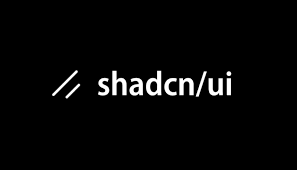

  

  

  <b>Merhaba, ben Zeynep 👋</b> 
  <i>Frontend Developer | React & Next.js Specialist</i>

---

## ❄️ Ben Kimim?

Kod ve tasarımı bir araya getirerek  
**fikirleri → ölçeklenebilir → modern → kullanıcı dostu arayüzlere**  
dönüştürmeyi seviyorum.

🎯 Odak noktam:
- Temiz mimari
- Performanslı React uygulamaları
- Gerçek projelerde sürdürülebilir frontend yapıları

Yeni yıl ruhuyla ✨ üretmeye, öğrenmeye ve paylaşmaya devam ediyorum.

---

## 🎁 Teknolojiler & Araçlar

### 🧩 Frontend
- React • TypeScript • Next.js  
- Tailwind CSS • Shadcn UI  
- Zustand • Context API  

### 🎨 Tasarım
- Figma
- UI/UX Prototipleme
- Design → Code dönüşümü

### 🛠️ Araçlar
- Git • GitHub
- VS Code
- Postman
- Docker • NPM

---

## ❄️ İlgi Alanlarım

- 🧼 Clean Code
- 🧠 Frontend Architecture (Service / Hook / UI ayrımı)  
- 🎯 Figma tasarımlarını birebir React bileşenlerine dönüştürmek  
- ⚡ Performans, erişilebilirlik ve SEO dostu arayüzler  

---

## 🧊 Kullandığım Teknolojiler

  
  
  
  
  
  
  
  
  
  
  
  

---

## 🚀 Şu An Ne Yapıyorum?

- 🔐 Protected Routes & Role-Based Access projeleri
- 🏗️ SaaS dashboard mimarileri
- 📦 Service / Hook / UI ayrımı olan projeler
- 🌍 i18n & SEO uyumlu Next.js uygulamaları

---

## ☕ Bir Kahve Al, Projelere Bak!

Kahveni al, repoları incele
belki birlikte bir şeyler üretiriz 🚀❄️

---

  <i>“Good UI is invisible, good code is unforgettable.”</i>

