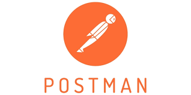
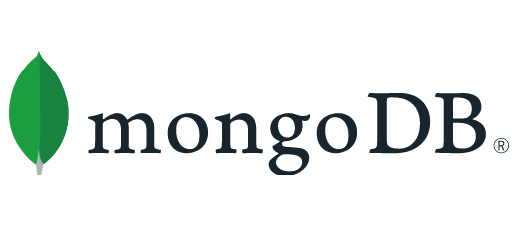

  

# Merhaba! 

Ben Zeynep, **Yazılım Geliştiricisiyim**.

Kod ve tasarımı birleştirerek fikirleri **hızlı ve etkili arayüzlere** dönüştürmeyi seviyorum.  

---

## 🛠 Teknoloji ve Araçlar
- **Frontend:** React, TypeScript, Next14, Tailwind CSS, Zustand, Context API  
- **Backend:** Node.js, Express, MongoDB  
- **Tasarım:** Figma, UI/UX prototip tasarımı  
- **Araçlar:** Git, GitHub, VS Code, Postman  

---

## 🎯 İlgi Alanlarım
- Kodlama ve yazılım geliştirme  
- Figma ile prototipi React'ta geliştirmek

---

             

---

💡<b> Not:</b> Sürekli olarak yeni projeler geliştiriyor ve GitHub hesabımda paylaşıyorum. Göz atmayı unutma! 🚀

  

