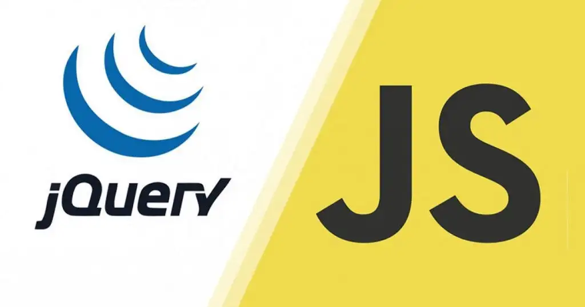

# Merhaba! 

Ben Zeynep, **Yazılım Geliştiricisiyim**.

Kod ve tasarımı birleştirerek fikirleri **hızlı ve etkili arayüzlere** dönüştürmeyi seviyorum.  

---

## 🛠 Teknoloji ve Araçlar
- **Frontend:** React, TypeScript, Tailwind CSS, Redux, Context API  
- **Backend:** Node.js, Express, MongoDB, MySQL  
- **Tasarım:** Figma, UI/UX prototip tasarımı  
- **Araçlar:** Git, GitHub, VS Code, Postman  

---

## 🎯 İlgi Alanlarım
- Kodlama ve yazılım geliştirme  
- Figma ile hızlı prototip tasarımı Reactta geliştirmek

  

    <h1 style="color:red">Skills:</h1>
    
      
         
   
       
         
           
         
       
   
          
            

  

